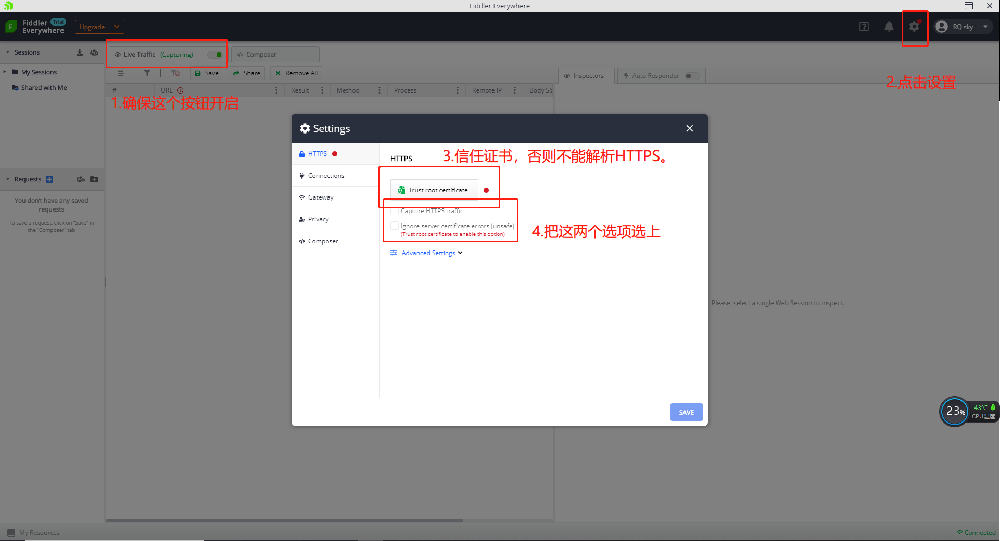
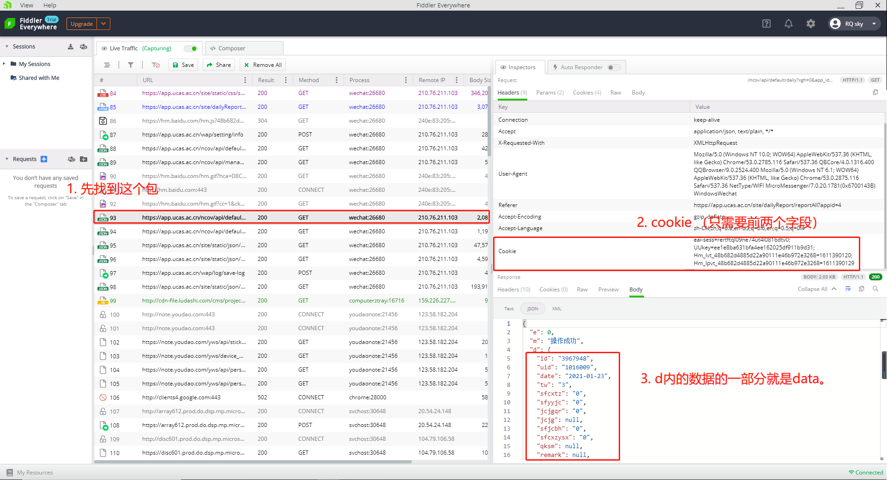
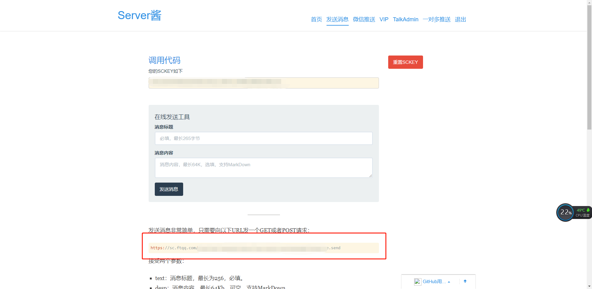
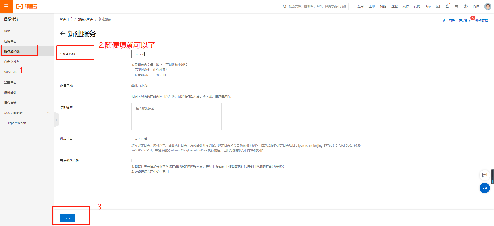
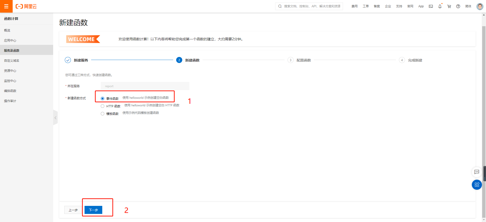
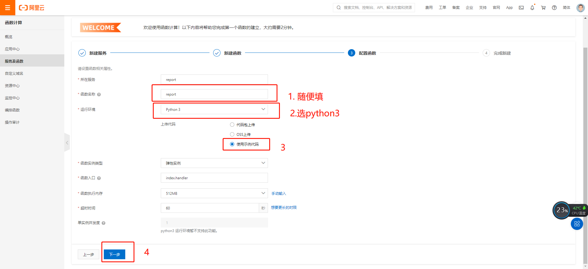
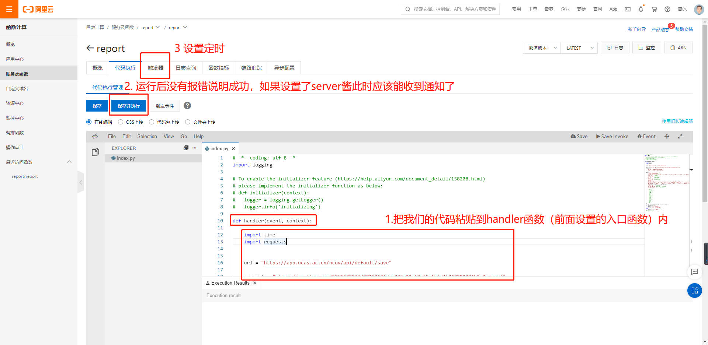
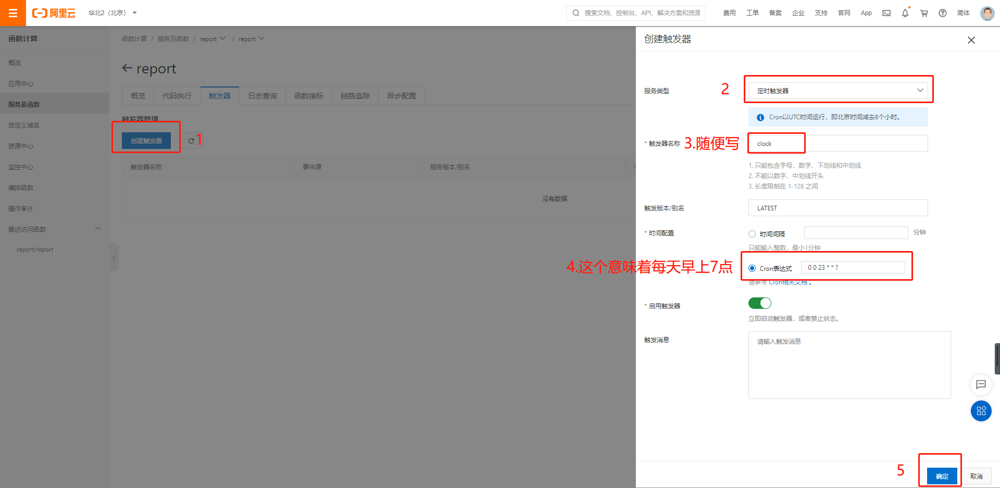
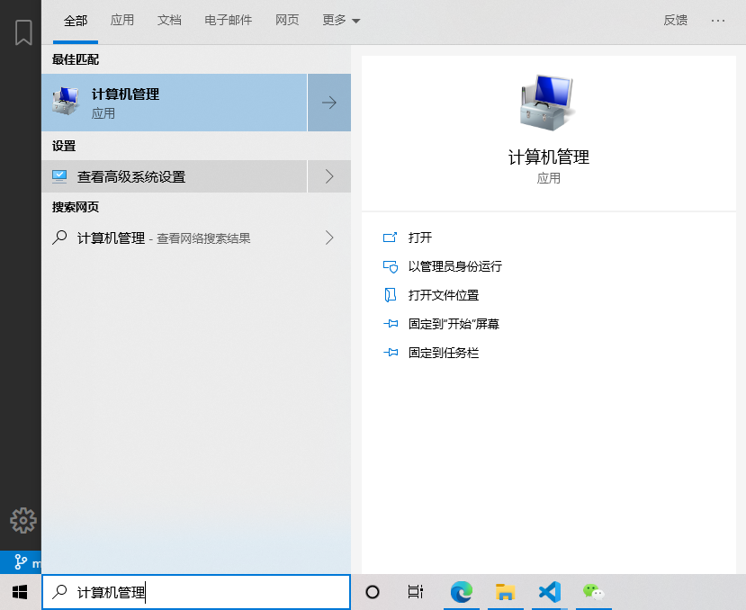
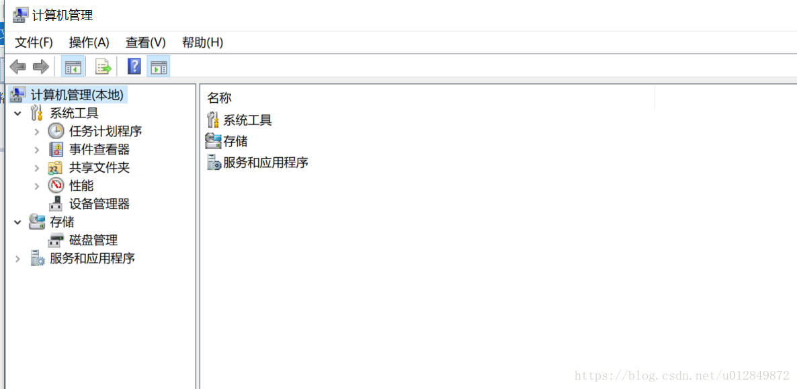

# 国科大AI院自动化疫情填报

基于 Python3 的适用于国科大AI院（非全）的 COVID-19 自动填报脚本  
项目用于学习交流，仅用于各项无异常时打卡，如有身体不适等情况还请自行如实打卡

## 目录
1. 安装配置抓包工具，抓微信的包获得cookie（和data）
2. 配置脚本
3. 部署脚本
4. 致谢

## 安装配置抓包工具（这里用 fiddler）

1. 下载安装，官网： https://www.telerik.com/download/fiddler-everywhere
2. 按图操作
  
3. 完事之后，可以打开几个网页试试，就能看到抓到很多包了。

## 配置脚本

1. 电脑端，使用‘企业微信’或者‘微信’进入‘个人每日填报’页面，抓包，获得'cookie'。
2. 把这个项目clone到本地，我们要利用抓包的一些数据修改report.py里的一些变量值。
  
3. 配置'cookie'：把抓包的'cookie'的'eai-sess'和'UUkey'字段的值，复制到 report.py 里。
4. 配置'data'，这里我们分别讨论一下自动化所，北京其他所或已回家，以及发烧，密接或者被隔离的情况。
    1. 自动化所同学，只需要填写 "realname"（姓名）和 "number"（学号）。
    2. 北京其他所或已回家同学，除了姓名学号之外，还要修改 "geo_api_info"（地址）和 "old_city"（也许代表昨天填的地址）。修改方法就是在上图所示的data内容里找个这两个同名的属性，复制粘贴即可。（要注意的是"geo_api_info"可能找不到，那么两个属性的值都设置为"old_city"的值即可）
    3. 发烧，密接或者被隔离的同学，这样的话数据就千奇百怪了，那么可以使用万能方法。
        1. 首先自己老实填报一次，然后退出，再进入‘个人每日填报’页面抓包。
        2. 把整个'd'属性内的数据粘贴到data里，然后修改2个属性，添加1个属性。分别是，修改"geo_api_info"，使得它和"old_city"保持一致；修改"date"的值为 time.strftime("%Y-%m-%d", time.localtime()) （这是表达式，不要加引号）；添加 "app_id": "ucas"。
5. （可选）开启微信通知，接收填报结果反馈。推荐使用 Server酱。  
    1. Server酱网站：http://sc.ftqq.com/3.version
    2. 登陆 -> 把下图的url复制到report.py的'mes_url'里 -> 绑定微信推送
      
6. （如果自己要在本地测试的话，要安装requests包，另外要关掉fiddler）

## 自动化
服务器我玩的不6，应该和下面linux是同理吧。除服务器之外，腾讯云，阿里云等云函数也可以部署。个人电脑也可以。

### 阿里云函数

1. 注册。官网： https://fc.console.aliyun.com/fc/overview/cn-beijing
2. 新建服务和函数，按图操作。



3. 配置代码和触发器（阿里云使用的cron表达式设置的时间要比北京时间慢8h，`0 0 23 * * ?` 第三位代表小时，这个表达式代表早晨7点）



### Windows：任务计划程序

1. 在 windows搜索：“计算机管理”，进入如下界面：


2. 选择 系统工具 -->  任务计划程序 ，点击右侧的  “创建基本任务”，进入如下界面
3. 参考这篇博文：https://blog.csdn.net/u012849872/article/details/82719372

### Linux：使用 Crontab

```shell script
sudo crontab -e
```

每天早晨 6 点上报

```shell script
0 6 * * * python3 report.py
```

## 致谢

1. 感谢 `https://github.com/Swenchao/bjut_clock` 和 `https://github.com/W0n9/BUCT_COVID-19_Report` 对本项目的支持
